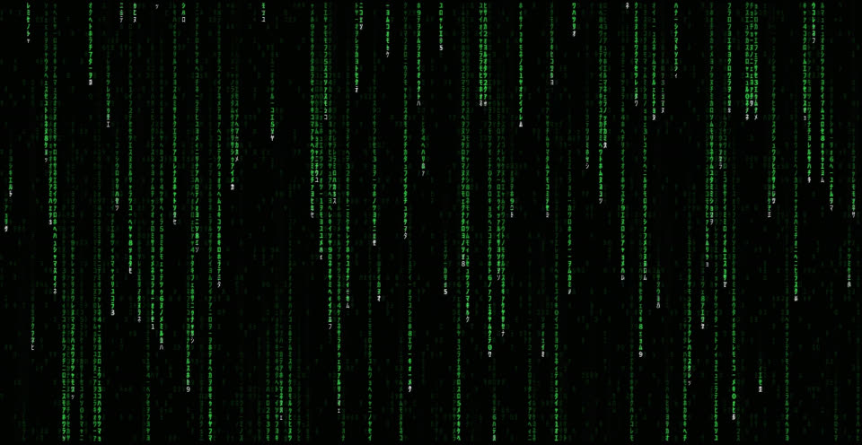

# Omarchy Matrix Digital Rain

An animated, seamlessly-looping Matrix-style digital rain wallpaper for
[Omarchy](https://omarchy.org)'s Matrix theme — four selectable text sizes
you flip through with Omarchy's normal background switcher, exactly like
picture wallpapers on any other theme.



This was designed and tested **on Omarchy** (Hyprland + `mpvpaper` +
`omarchy-theme-*` tooling). It won't work as-is on a different window
manager or a non-Omarchy Hyprland setup — the wallpaper launcher and
variant-switching both depend on Omarchy-specific tools.

## What this actually is

Two things layered together:

1. **`matrix_rain.py`** — a pure-Python (Pillow + ffmpeg) generator that
   renders the rain as an exactly, mathematically seamless looping video
   (not GIF-quality, not blended/crossfaded — every falling stream's cycle
   length is snapped to an exact divisor of the total loop length, so the
   loop point is bit-for-bit identical frame content, not an approximation).
   Read the long comment at the top of that file if you're going to change
   font sizes, loop length, or speed tuning — it documents several
   non-obvious ways those interact, each found the hard way once.
2. **`matrix-wallpaper`** — a small launcher script that plays one of the
   rendered variants with `mpvpaper`, and watches Omarchy's normal "current
   background" symlink so the standard background-switcher UI
   (`SUPER CTRL+SPACE`, or `omarchy-theme-bg-next`) can flip between them —
   the same mechanism every other Omarchy theme's picture backgrounds use,
   even though `mpvpaper` only knows how to play video files. See the
   comment at the top of that script for how that mapping works.

## Requirements

- [Omarchy](https://omarchy.org) (Hyprland-based)
- `python3` + Pillow (`python-pillow`)
- `ffmpeg`
- `mpvpaper`
- `inotify-tools` (for `inotifywait`)
- `jq` (used by the installer to detect your screen resolution)
- A font with half-width katakana glyphs — `noto-fonts-cjk` covers it. This
  one's easy to miss: without it, `matrix_rain.py` silently falls back to
  plain digits/letters and the rain won't look like actual Matrix rain
  (with a warning printed when that happens, but the installer checks for
  this up front so you don't render 4 variants and then notice).

On Omarchy/Arch: `sudo pacman -S --needed python python-pillow ffmpeg mpvpaper inotify-tools jq noto-fonts-cjk`

## Install

```sh
git clone https://github.com/tinterian/omarchy-matrix-rain.git
cd omarchy-matrix-rain
./install.sh
```

This renders all 4 variants locally at your screen's resolution (small,
medium, large, xlarge text) — **expect roughly 15-25 minutes**, one time.
It installs:

- `~/.config/omarchy/themes/matrix/{colors.toml,icons.theme,neovim.lua,
  vscode.json,unlock.png}` (each installed only if that specific file isn't
  already there — never overwrites an existing customization)
- the 4 rendered `.mp4` variants + poster stills into
  `~/.config/omarchy/themes/matrix/backgrounds/`, plus a freshly-generated
  `preview.png` for the theme switcher (regenerated every run, so it always
  matches your actual screen resolution — not skip-if-exists like the files
  above)
- `~/.local/bin/matrix-wallpaper`
- `~/.config/systemd/user/matrix-wallpaper.service` (enabled + started)
- if an AUR helper (yay/paru) is available: the `beautyline` icon pack +
  a generated `BeautyLine-Matrix` variant into `~/.local/share/icons/`
  (see "The rest of the theme" below)

Then select the theme if it isn't active already:

```sh
omarchy-theme-set matrix
```

or pick **Matrix** from Omarchy's theme menu.

## Switching between variants

Once the Matrix theme is active, the rain plays automatically. Flip
between small/medium/large/xlarge text with Omarchy's normal background
switcher:

- **`SUPER CTRL + SPACE`** (Background switcher — shows all 4 as
  thumbnails)
- or `omarchy-theme-bg-next` to just cycle to the next one

## The rest of the theme

Beyond the wallpaper, the theme ships the standard set of files Omarchy
themes use to recolor the rest of your apps to match — applied automatically
by `omarchy-theme-set-templates` and the per-app `omarchy-theme-set-*`
scripts when you select Matrix, no extra steps needed:

- **`colors.toml`** — the palette every other file/template derives from
  (terminal, GTK, btop, etc. via Omarchy's built-in templating).
- **`icons.theme`** — `BeautyLine-Matrix`, a generated variant of the
  [`beautyline`](https://gitlab.com/garuda-linux/themes-and-settings/artwork/beautyline)
  outline icon pack (AUR), built by `generate_matrix_icons.py` (run
  automatically by `install.sh` if an AUR helper is found) into
  `~/.local/share/icons/BeautyLine-Matrix/`. Covers everything a file
  manager can show, two different ways:
  - The ~19 folders you actually see by default (`folder`, `folder-open`,
    `user-home`, `user-desktop`, the `default-folder-<xdg-dir>` set) get a
    full recolor: gradient replaced end to end with a
    dark-green-to-black fill.
  - Everything else — the ~200 remaining decorative/legacy-alias folder
    variants, every device icon (drives, phones, cameras — devices/), and
    every file-type icon (mimetypes/) — keeps its own original colors and
    just gets a black gradient faded in at the bottom, so a PDF still
    looks like a PDF, an image icon still looks like an image, etc.

  Applied via `gsettings set org.gnome.desktop.interface icon-theme` —
  the one real "default icon theme" mechanism every installed file manager
  here reads (this machine only has Nautilus, a GTK4 app that reads this
  key directly; there's no separate per-file-manager setting to
  replicate). If `beautyline` isn't installed, icons just fall back to
  whatever was active before — `Inherits=` in the generated
  `index.theme` also means anything this generator doesn't touch (app
  launcher icons, status/network-signal icons — checked, nothing file-
  explorer-relevant there) falls back to stock BeautyLine automatically.
- **`unlock.png`** — the OMARCHY wordmark recolored to the theme's accent
  green (`#39C04F`), same pixel-identical mask every stock theme uses, just
  retinted.
- **`neovim.lua`** — points LazyVim at
  [`iruzo/matrix-nvim`](https://github.com/iruzo/matrix-nvim), a real
  green-on-black Matrix colorscheme plugin. Only takes effect if you use
  Omarchy's LazyVim-based Neovim config; it'll install the plugin itself the
  next time Neovim starts after selecting the theme.
- **`vscode.json`** — points Omarchy's VS Code/VSCodium/Cursor sync at the
  [`UstymUkhman.matrix-theme`](https://marketplace.visualstudio.com/items?itemName=UstymUkhman.matrix-theme)
  extension. Omarchy installs it as a local generated extension automatically;
  it doesn't install the marketplace extension for you, so if you use one of
  those editors, install `UstymUkhman.matrix-theme` from its marketplace once.
- **`preview.png`** — the thumbnail Omarchy's theme switcher (the image-grid
  menu you open to pick a theme) shows for Matrix, generated by
  `generate_matrix_preview.py` from the medium wallpaper variant, cropped to
  1800x1012 (the same dimensions every stock theme's preview uses) and
  palette-quantized to match their file size. `omarchy-theme-switcher` looks
  for this specific file — without it, the switcher falls back to showing
  the theme's first background file instead, which still works but isn't a
  curated thumbnail.

Not included: `preview-unlock.png`, a lock-screen preview screenshot stock
themes ship for the Omarchy website gallery (distinct from `unlock.png`
above, which *is* included). Confirmed by reading the actual running lock
screen (`LockView.qml`) and grepping the installed `omarchy` package: nothing
on the system reads `preview-unlock.png` — only `preview.png` is actually
wired into a visible UI (the theme switcher, see above). It only matters if
this theme is ever submitted upstream to become a stock theme.

## Customizing

Everything about the animation — font size, colors, rain density, trail
length, loop duration — is controlled by `matrix_rain.py`'s CLI flags. Run
`python3 matrix_rain.py --help`, and **read the "IF YOU CHANGE SOMETHING
LATER" section in that file's header comment first** if you're touching
font size or loop length specifically — there's a non-obvious interaction
between those and how varied the rain's fall speeds look that cost several
iterations to get right the first time, and the header tells you exactly
how to avoid repeating that and how to verify a change is safe before
committing to a multi-minute render.

To add a 5th size variant (or replace one of the 4), see the same section
— it has the exact procedure (including the easy-to-miss
`omarchy-theme-refresh` step Omarchy needs before it'll notice a new
background file).

## Uninstall

```sh
./uninstall.sh
```

Removes the service, launcher, and generated backgrounds. Leaves
`colors.toml` in place (delete
`~/.config/omarchy/themes/matrix` yourself if you want the theme gone
entirely).

## For an AI agent doing this install

If you're an AI coding agent installing this for someone, here's the
explicit sequence assuming nothing but a **basic Omarchy install** (no
Matrix theme, nothing customized yet). This was built and verified on
Omarchy specifically — don't try to adapt it to a non-Omarchy Hyprland
setup without telling the user it's untested there.

1. Confirm you're actually on Omarchy: `command -v omarchy-theme-set` should
   resolve. If it doesn't, stop — this repo won't work.
2. Clone this repo somewhere persistent (not `/tmp`), e.g. `~/Work/` or
   wherever the user keeps things like this.
3. Run `./install.sh` from inside the clone. It is interactive exactly
   once (a y/N prompt if a dependency needs `sudo pacman -S`) — everything
   else is unattended. It will take 15-25 minutes; don't kill it early, and
   don't run multiple installs concurrently (each render is CPU-bound and
   they'll just contend with each other).
4. After it finishes, check the theme is actually selected:
   `cat ~/.local/state/omarchy/current/theme.name` should print `matrix`.
   If not, run `omarchy-theme-set matrix`.
5. Verify the wallpaper is actually running:
   `systemctl --user is-active matrix-wallpaper.service` should print
   `active`, and `pgrep -af mpvpaper` should show one process with a path
   under `~/.local/state/omarchy/current/theme/backgrounds/`.
6. Tell the user they can flip between the 4 text sizes with
   `SUPER CTRL + SPACE` — this is the same keybinding Omarchy uses to flip
   any other theme's picture backgrounds, nothing new to learn.
7. If anything fails, read the top-of-file header comments in
   `matrix_rain.py` and `matrix-wallpaper` before guessing — both carry a
   detailed history of exactly what's fragile and why, written specifically
   so a fresh agent doesn't have to rediscover it.

## License

MIT — see `LICENSE`.
